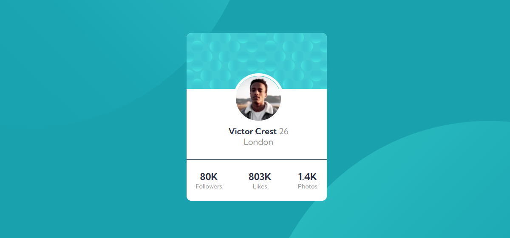

# Frontend Mentor - Profile card component solution

This is a solution to the [Profile card component challenge on Frontend Mentor](https://www.frontendmentor.io/challenges/profile-card-component-cfArpWshJ). Frontend Mentor challenges help you improve your coding skills by building realistic projects. 

## Table of contents

- [Overview](#overview)
  - [The challenge](#the-challenge)
  - [Screenshot](#screenshot)
  - [Links](#links)
- [My process](#my-process)
  - [Built with](#built-with)
  - [What I learned](#what-i-learned)
  - [Continued development](#continued-development)

**Note: Delete this note and update the table of contents based on what sections you keep.**

## Overview

### The challenge

- Build out the project to the designs provided

### Screenshot
Dekstop

Mobile

### Links

- Solution URL: [https://github.com/nonoza/nonoza-profile-card-component-main](https://github.com/nonoza/nonoza-profile-card-component-main)
- Live Site URL: [https://nonoza.github.io/nonoza-profile-card-component-main/](https://nonoza.github.io/nonoza-profile-card-component-main/)

## My process
- Built a structure with HTML elements.
- Styled using CSS
### Built with
- Semantic HTML5 markup
- CSS custom properties
- Flexbox

### What I learned

- Had a challenge with the background image but I managed to work on it.

## Author

- Website - [Pretty Kunene](https://prettynkunene.co.za/)
- Frontend Mentor - [@nonoza](https://www.frontendmentor.io/profile/nonoza)

